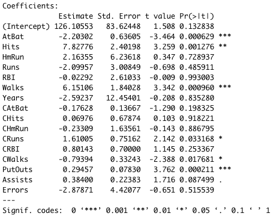
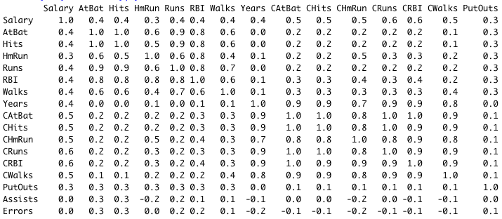

# Moneyball Analytics
Sport analytics started to gain its popularity after the Oakland A's applied data-driven approach for its player assessment and team formation. In the 1990s, the Oakland A's was one of the most poorly performing teams in the Major Baseball League (MBL). The player recruitment was done mainly through scouting from high school and college games. After the Oakland A's adopted the analytics methods to detect undervalued players, quickly they were able to achieve success in the field. They made it to the playoffs in 2002 and 2003 despite a much lower payroll than their competitors. This ignited a revolution in sports, placing analytics now in the central of every team's strategy.

Here I predicted the salary of baseball players based on the dataset that contains information on 263 players from the MLB in 1986. The first column reports the player names, the second column reports the player annual salaries (in $’000), which I aim to predict. The other variables report four sets of variables: offensive statistics during the season, offensive statistics over the player’s career, defensive statistics, and team information.

## Data Exploration
Let's first extract only the numerical predictors from the dataset to look at their correlations between each other.<br />
```bash
hitters_raw <- read.csv("Hitters.csv")
hitters_num <-hitters_raw[,2:18]
ggcorrplot(round(cor(hitters_num),1), method="circle", 
           tl.col = "black", tl.cex = 15, lab=TRUE)
```
<p align="center">

</p>
The matrix above indicates that there are high correlations among the player’s performance records, such as the numbers of walks, RBI, runs, homeruns, hits, and at bat. Furthermore, the correlation is more prominent over the period of player’s career than the season, presumably due to the larger pool of samples. The two most highly correlated predictors to the salary are CRuns (Number of runs in the career) and CRBI (Number of runs enabled in the career). Although we can tell those two predictors have any sorts of relationship with the salary, it does not imply causation. There are several possible explanations: (a) A influences B; (b) B influences A; and (c) A and B are influenced by one or more additional variables.
<br /><br />
Now let's look at the p-values of the predictors. The p-values below indicate that AtBat (Number of times at bat in the season), Walks (Number of walks in the season), and PutOuts (Number of putouts in the season) are statistically significant, meaning they effect strongly on the salary variable.
<br />
<p align="center">

</p>

<br />




