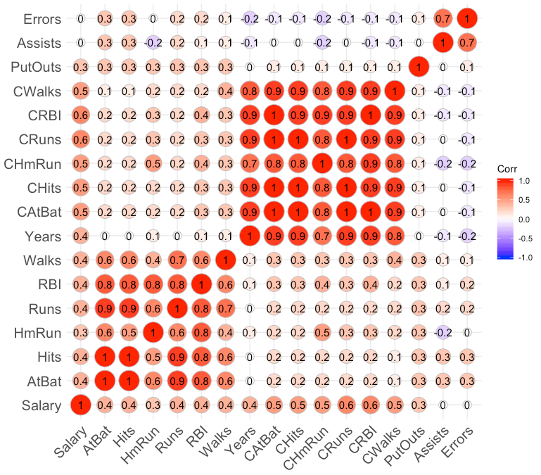
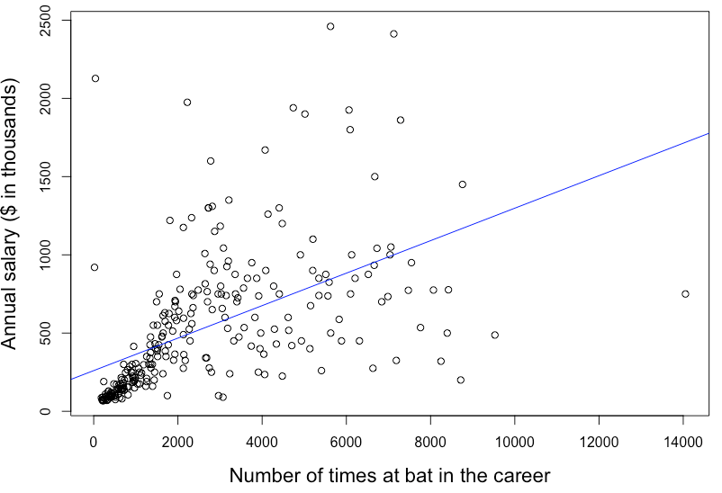
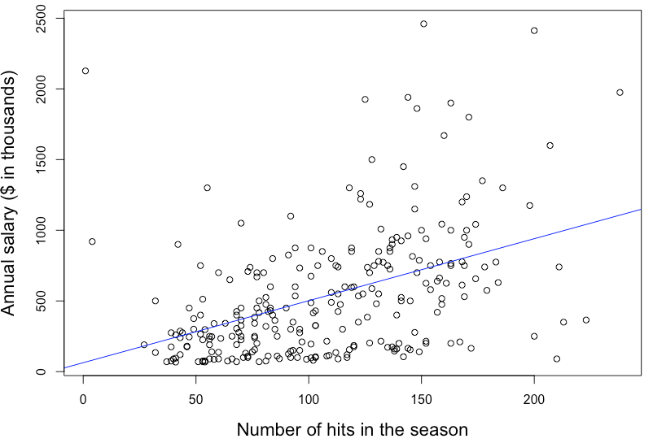

# Moneyball Analytics
Sport analytics started to gain its popularity after the Oakland A's applied data-driven approach to its player assessment and team formation. In the 1990s, the Oakland A's was one of the worst performing teams in the Major Baseball League (MBL). Their player recruitment was done mainly through scouting from high school and college games. After the Oakland A's adopted the analytics methods to detect undervalued players, quickly they were able to achieve success in the field. They made it to the playoffs in 2002 and 2003 despite a much lower payroll than their competitors. This ignited a revolution in sports, placing analytics now in the center of every team's strategy.

Here I predicted the salary of baseball players based on the dataset that contains information on 263 players from the MLB in 1986. The first column reports the player names, the second column reports the player annual salaries (in $’000), which I aim to predict. The other variables report four sets of variables: offensive statistics during the season, offensive statistics over the player’s career, defensive statistics, and team information.

## Data Exploration
Let's first extract only the numerical predictors from the dataset to look at their correlations between each other.<br />
```bash
hitters_raw <- read.csv("Hitters.csv")
hitters_num <-hitters_raw[,2:18]
ggcorrplot(round(cor(hitters_num),1), method="circle", 
           tl.col = "black", tl.cex = 15, lab=TRUE)
```
<p align="center">

</p>
For the player's statistics during the season (lower-left box cluster), AtBat(the number of times at bat) and Hits (the number of hits) are highly correlated with Runs (the number of runs). For the player's statistics during the career (upper-right box cluster), all the predictors are highly correlated to each other. 

Considering the baseball's game rules, these observations are valid.

If we look at the predictors that are correlated to the salary, CRuns (Number of runs in the career) and CRBI (Number of runs enabled in the career) show relatively high correlation. However, it does not imply causation. There are several possible explanations: (a) A influences B; (b) B influences A; and (c) A and B are influenced by one or more additional variables.
<br /><br />
Now let's look at the p-values of the predictors to understand the relationships between the salary and other predictors.

```bash
lm.mod <- lm(Salary ~., data = hitters_num)
summary(lm.mod)
```
<p align="center">

</p>
The predictors with the significance at the 95% level are AtBat, Hits, Walks, CRuns, CWalks, and PutOuts, meaning these predictors effect strongly on the salary variable.

The in-sample and out-of-sample R2 are 0.5603 and 0.4004 respectively. Given the dataset as visualized in Question a, these outcomes are expected.

<br />



<br />
Likewise, the player’s salary increases as the number of hits in the season increases.
<br />


<br />

## Fit a linear regression model using training set

The data is normalized and split into a training set and a test set in a ratio of 7:3. The linear regression model was created using all the predictors of the training set. The summary of linear regression model indicates that variables with the high significance at the level of 95 % (p values < 0.05) are AtBat, Hits, Walks, CWalks, and PutOuts. These variables have the most impact on the salary variables. From the signs of coefficient values, we can learn that the number of times at bat in the season and the number of walks in the career are negatively correlated with the salary. Likewise, the numbers of hits, walks, putouts in the season are positively correlated with the salary.
<br />

In-sample 𝑅^2

<br />
The in-sample and out-of-sample 𝑅!are 0.5603 and 0.4004 respectively. Considering the large number of outliers observed in the visualization in a) and the value of residual standard error (0.7092) shown above, these outcomes are expected.

## Fit a restricted linear regression model selecting only the predictors with significance
<br />
Five predictors with p value under 0.05 were selected to fit a linear regression model.
<br /><br />
In-sample coefficients and 𝑅^2 Out-of-sample 𝑅^2<br />
capture of result
<br /><br />
Only includes only those significant variables with stars.
Full -> remove insignificant variables -> remove multicollinear variable

## Regularization
i) Train Ridge regression and LASSO models with 10-fold cross-validation

Plots of cross-validated Mean Squared Error as a function of l: