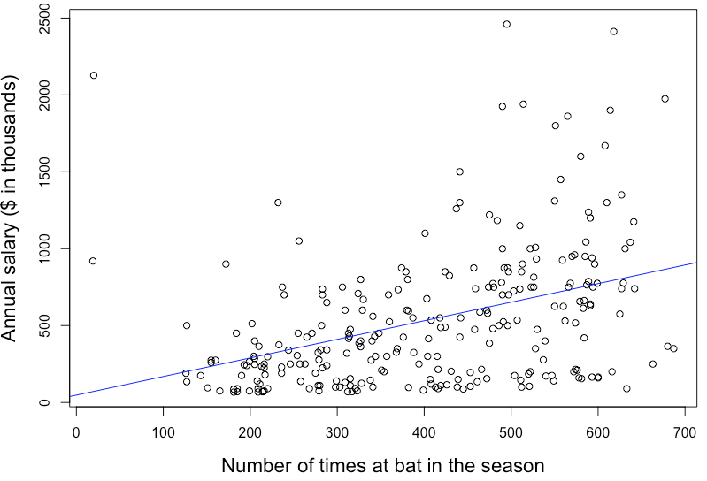

# Moneyball Analytics
Sport analytics started to gain its popularity after the Oakland A's applied data-driven approach for its player assessment and team formation. In the 1990s, the Oakland A's was one of the most poorly performing teams in the Major Baseball League (MBL). The player recruitment was done mainly through scouting from high school and college games. After the Oakland A's adopted the analytics methods to detect undervalued players, quickly they were able to achieve success in the field. They made it to the playoffs in 2002 and 2003 despite a much lower payroll than their competitors. This ignited a revolution in sports, placing analytics now in the central of every team's strategy.

Here I predicted the salary of baseball players based on the dataset that contains information on 263 players from the MLB in 1986. The first column reports the player names, the second column reports the player annual salaries (in $’000), which I aim to predict. The other variables report four sets of variables: offensive statistics during the season, offensive statistics over the player’s career, defensive statistics, and team information.

## Explore the dataset
Let's first extract only the numerical predictors from the dataset to look at their correlations between each other.  

   
The upper-left matrix indicates that there are high correlations among the player’s performance records, such as the numbers of walks, RBI, runs, homeruns, hits, and at bat; it is more prominent over the period of player’s career than the season. Three most highly correlated predictors to the salary are CAtBat (Number of times at bat in the career), AtBat (Number of times at bat in the season), and Hits (Number of hits in the season).

We can learn from the plots below that the correlation between the salary and the player's at bat records is more prominent through the period of career than the season. This is presumably due to the larger sampling of observations over a longer period of time.
 

    

